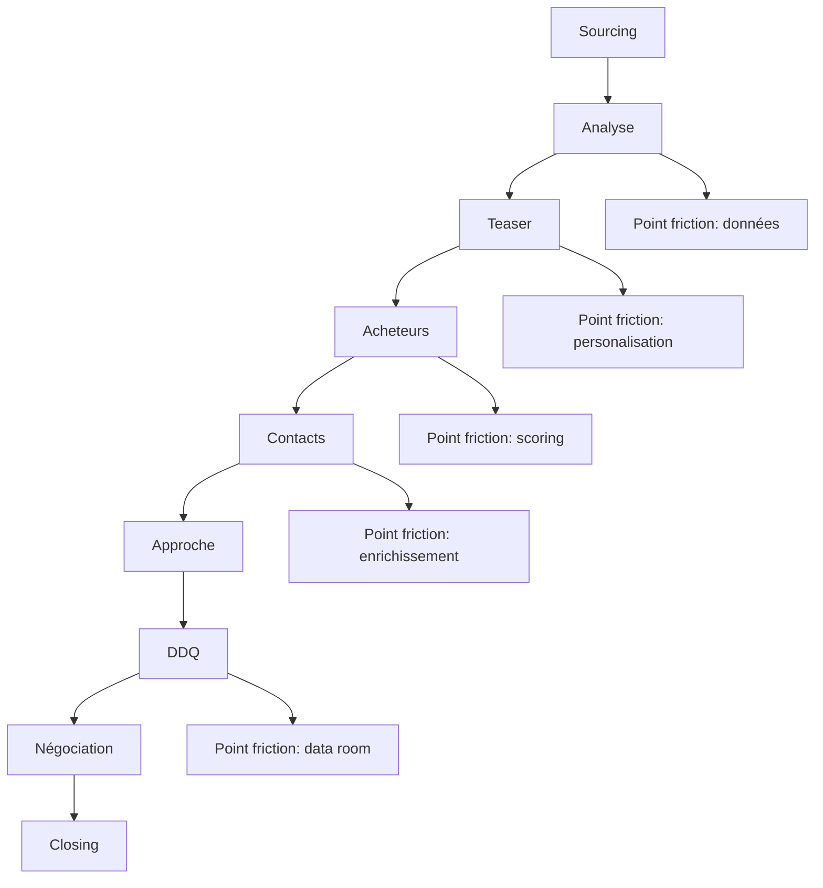

# Analyse des Points de Friction du Pipeline M&A

## Vue d'ensemble des points de friction identifiés

Après analyse du pipeline actuel et des processus existants, les principaux points de friction ont été cartographiés par étape.

### 1. Phase Sourcing (Scouting)

| Friction | Impact | Urgence | Solution envisagée |
|----------|--------|---------|-------------------|
| Volume d'opportunités non filtré | Élevé | Haute | Système de scoring pré-qualification automatisé |
| Détection tardive des annonces | Moyen | Moyenne | Pipeline de monitoring proactif sur sources clés |
| Absence de tagging par secteur | Élevé | Haute | Taxonomie sectorielle standardisée |

### 2. Phase d'Analyse

| Friction | Impact | Urgence | Solution envisagée |
|----------|--------|---------|-------------------|
| Manque de données financières structurées | Élevé | Haute | Template d'extraction SIRENE + BODACC |
| Qualification humaine coûteuse | Moyen | Moyenne | Checklists automatisées avec scoring |
| Délai de décision trop long | Moyen | Basse | Processus d'analyse hiérarchisée |

### 3. Phase de Teaser & Outreach

| Friction | Impact | Urgence | Solution envisagée |
|----------|--------|---------|-------------------|
| Personnalisation limitée des teasers | Moyen | Moyenne | Modèles dynamiques avec variables |
| Enrichissement manuel des contacts | Élevé | Haute | API d'enrichissement automatisé |
| Tracking des interactions absent | Élevé | Haute | CRM intégré avec pipeline |

### 4. Phase de Due Diligence

| Friction | Impact | Urgence | Solution envisagée |
|----------|--------|---------|-------------------|
| Accès à la data room restreint | Élevé | Haute | NDA étendu template négocié |
| Audit incomplet des contrats clés | Élevé | Haute | Checklists contractuelles sectorielles |
| Absence de scoring risque social | Moyen | Moyenne | Matrice de risque RH pré-définie |

### 5. Phase de Négociation & Closing

| Friction | Impact | Urgence | Solution envisagée |
|----------|--------|---------|-------------------|
| Périmètre non aligné tribunal | Élevé | Haute | Validation par专家 judiciaire pré-dépôt |
| Financement post-offre lent | Moyen | Basse | Pré-qualification banques early stage |
| Intégration post-closing structurée | Moyen | Basse | 100 jours checklist intégration |

## Cartographie des dépendances

## Priorisation des actions

### Actions immédiates (0-30 jours)
1. **Template scoring pré-qualification** - Automatiser le filtrage initial
2. **Checklist DDQ sectorielle** - Standardiser la due diligence
3. **CRM intégré pipeline** - Centraliser les interactions

### Actions à moyen terme (30-90 jours)
1. **API d'enrichissement contacts** - Accélérer la phase sourcing acheteurs
2. **Modèles teasers dynamiques** - Personnaliser les approches
3. **Validation juridique pré-dépôt** - Réduire le risque tribunal

### Actions à long terme (90-180 jours)
1. **Pipeline kanban visuel** - Améliorer le suivi des deals
2. **Tableau de bord KPIs** - Mesurer l'efficacité par étape
3. **Processus intégration post-closing** - Optimiser la valeur post-deal

## Metrics de suivi à implémenter

| Métrique | Cible | Fréquence |
|----------|-------|-----------|
| Deal-to-close ratio | 15-20% | Mensuel |
| Temps moyen par étape | < 7j | Quotidien |
| Taux de conversion sourcing | 30% | Hebdomadaire |
| ROI par canal sourcing | Calculé | Mensuel |

## Related
- [[brantham/_MOC]]
- [[brantham/pipeline/board]]
- [[brantham/deals/template]]
- [[brantham/knowledge/process/end-to-end]]