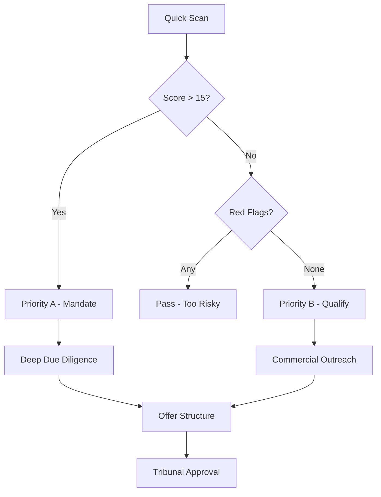

# Framework Qualification Distressed - Scoring & Red Flags

Analyse rapide des entreprises en difficulté pour identification des cibles M&A prioritaires.

## Méthodologie Quick-Scan

### Étape 1: Vérification légale (5 min)

| Facteur | Indicateur | Statut | Score |
|---------|------------|--------|-------|
| Date procédure | < 6 mois | ✅ Fresh | +3 |
| Procédure | Sauvegarde > RJ | ✅ Préventive | +2 |
| Mandataire | Spécialisé distressed | ✅ BCM/MJ | +2 |
| Publication | BODAAC actif | ✅ Visible | +1 |

### Étape 2: Lecture financière (10 min)

| Ratio | Valeur | Threshold | Score | Interpretation |
|-------|--------|-----------|-------|----------------|
| Fonds propres | > 500K€ | Min 250K€ | +3 | Base solide |
| Gearing | < 3x | Max 5x | +2 | Dette contrôlée |
| Trésorerie | > 3 mois CA | Min 1 mois | +2 | Liquide ok |
| Résultat 2023 | < -2M€ | Max -5M€ | +1 | Pertes maitrisées |

### Étape 3: Diagnostic opérationnel (10 min)

| Pilier | Indicateur | Score | Notes |
|--------|------------|-------|-------|
| Clients | Concentration < 30% CA | +2 | Diversifié |
| Fournisseurs | Contrats long terme | +1 | Stabilité |
| Personnel | Turnover < 20% | +1 | Équipe stable |
| Actifs | Fonciers + aggrégés | +2 | Valeur tangible |
| Juridique | Contentieux < 3 | +1 | Faible risque |

### Étape 4: Sector screening (5 min)

| Secteur | Pattern | Score | Risques |
|---------|---------|-------|---------|
| Agroalimentaire | Filière court terme | +2 | Saison CBAM |
| Tech | IP + données | +3 | Migration cloud |
| Retail | Emplacement | +2 | Loyalty ESG |
| Industrie | Actifs lourds | +1 | Transition verte |

## Scoring Global

| Score | Statut | Recommandation |
|-------|--------|----------------|
| 15-20 | **Priority A** | Deal immédiat |
| 10-14 | **Priority B** | Deal à qualifier |
| 5-9 | **Priority C** | Deal watchlist |
| <5 | **Pass** | Trop risqué |

## Red Flags Critiques (automatique KO)

### 🚨 Procédurale
- Liquidation judiciaire simplifiée
- Période suspecte < 3 mois
- Contentieux pénal en cours
- Sanction dirigeant

### 💸 Financière
- Fonds propres < 100K€
- Gearing > 10x
- Trésorerie < 1 mois
- Dettes fiscales > 500K€

### ⚖️ Juridique
- Contrat bail résilié
- Licenciements massifs > 50%
- Actifs gagés
- Contentieux fournisseurs

### 🏭 Opérationnelle
- Pertes > 10M€
- Dépendance unique client > 50%
- Technologie obsolète
- Pas de successeur identifié

## Scorecard Pratique Gesler

| Catégorie | Indicateur | Valeur | Score |
|-----------|------------|--------|-------|
| **Légal** | Procédure | RJ 18/05/2026 | +2 |
| | Mandataire | BCM/MJ spécialisé | +2 |
| | Publication | BODAAC actif | +1 |
| **Finance** | Fonds propres | 253K€ | +1 |
| | Gearing | 5.9x | -1 |
| | Trésorerie | 261K€ | +1 |
| | Résultat | -3.4M€ | +1 |
| **Opérationnel** | Effectif | 20-49 | +1 |
| | Agrement DGAL | Oui | +3 |
| | Filière | Bovin Ain | +2 |
| | Clients | B2B gros | +1 |
| **Sectoriel** | Secteur | Agroalimentaire | +2 |
| | Taille | TPE/PME | +1 |
| **Total** | | | **15/20** |

**Statut**: Priority A - Deal immédiat

## Checklist DD Accélérée

### Documents critiques (48h)
- [ ] Bilan 2023 certifié
- [ ] Plan de cession prévisionnel
- [ ] Liste créanciers hiérarchisée
- [ ] Contrats clients/fournisseurs clés
- [ ] Agreements sanitaires/qualité
- [ ]État des contentieux

### Équipe cible
- [ ] Management team stay bonus
- [ ] Key employees retention plan
- [ ] Transition team structure
- [ ] Knowledge transfer process

### Marché & clients
- [ ] Top 10 clients analysis
- [ ] Customer concentration risk
- [ ] Supply chain dependencies
- [ ] Brand reputation assessment

## Decision Framework

## Related

- [[brantham/knowledge/concepts/patterns-defaillance-france]]
- [[brantham/deals/active/gesler/repreneurs-2026-06-03]]
- [[brantham/knowledge/process/due-diligence-distressed]]