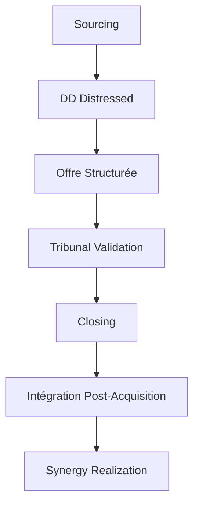

# M&A chez Brantham Partners

Cadre méthodologique pour les opérations de fusion-acquisition spécialisées en contextes judiciaires français.

## Contexte

Brantham Partners accompagne des repreneurs dans l'acquisition d'entreprises en procédure collective (redressement judiciaire, liquidation judiciaire, sauvegarde). Notre expertise couvre l'ensemble du cycle de vie M&A dans des contextes distressed.

## Statut Actuel

- **Deals actifs**: 7 opérations en monitoring
- **Revenue signé**: 14 k€ HT (Magic Form, 24/04/2026)
- **Spécialisation**: PME en difficulté, France métropolitaine
- **Focus**: Repreneurs (pas mandates AJ)

## Framework M&A Distressed

### 1. Sourcing & Identification de Cibles

**Sources de deals:**
- BODACC (procédures collectives)
- Infogreffe (mandat ad hoc, conciliation)
- Signaux externes (media, secteur)
- Réseau partenaires (banques, experts-comptables)

**Critères de sélection:**
- Potentiel de restructurable (>70%)
- Actifs stratégiques identifiables
- Marché porteur (taille >10M€)
- Positionnement concurrentiel

### 2. Due Diligence Spécifique

**Focus distressed:**
- [checklist-dd-distressed](patterns/checklist-dd-distressed.md)
- [due-diligence-checklist](patterns/due-diligence-checklist.md)
- Analyse des créanciers
- Valorisation actifs vs passif

**Risques clés:**
- Passif environnemental
- Responsabilités tiers
- Contrats litigieux
- Droit des baux

### 3. Structuration de l'Offre

**Mécanismes:**
- Plan de cession (L642-1+)
- Sauvegarde financière accélérée (SFA)
- Pre-pack cession
- Enchères judiciaires

**Éléments contractuels:**
- Garanties de passif limitées
- Price adjustments
- Échelonnement de paiement
- Conditions suspensives tribunal

### 4. Financement & Juridique

**Structures financières:**
- Fonds distressed spécialisés
- Prêts garantis par actifs
- Mezzanine distressed
- Equity repreneur

**Cadre légal:**
- Code de commerce (L611 à L647)
- Règlement UE 2015/848
- Droit des sociétés
- Fiscalité des cessions

### 5. Post-Acquisition Integration

**Modèles d'intégration:**
- [m-a-integration-model](../founder/patterns/m-a-integration-model.md)
- [ma-synergy-analysis-model](../patterns/ma-synergy-analysis-model.md)

**Focus opérationnel:**
- Stabilisation business
- Retention équipe clé
- Maintien relation client
- Optimisation coûts

## Patterns & Templates

| Template | Description |
|----------|-------------|
| [checklist-dd-distressed](patterns/checklist-dd-distressed.md) | Due diligence spécifique entreprises en difficulté |
| [due-diligence-checklist](patterns/due-diligence-checklist.md) | Checklist complète M&A classique |
| [ma-integration-model](../founder/patterns/m-a-integration-model.md) | Plan d'intégration post-acquisition |
| [ma-synergy-analysis-model](../patterns/ma-synergy-analysis-model.md) | Analyse et quantification des synergies |

## Case Studies Brantham

| Étude | Sector | Type | Leçon |
|-------|--------|------|-------|
| Orchestra-Premaman | Retail | Pre-pack cession | Importance du local vs étranger |
| Camaieu | Retail | Double procédure | Risque LBO toxique |
| Go-Sport | Sport | Cession concurrentielle | Rapidité d'exécution |
| Conforama | Retail | Scandale corporate | Due diligence actionnaires |

## Knowledge Base

### Procédures Collectives
- [liquidation-judiciaire](../knowledge/procedures/liquidation-judiciaire.md)
- [redressement-judiciaire](../knowledge/procedures/redressement-judiciaire.md)
- [sauvegarde](../knowledge/procedures/sauvegarde.md)
- [mandat-ad-hoc-conciliation](../knowledge/procedures/mandat-ad-hoc-conciliation.md)

### Finance & Valorisation
- [valorisation-distressed](../knowledge/finance/valorisation-distressed.md)
- [financial-modeling-distressed](../knowledge/finance/financial-modeling-distressed.md)
- [restructuration-dette](../knowledge/finance/restructuration-dette.md)

### Droit & Légal
- [plans-de-cession](../knowledge/legal/plans-de-cession.md)
- [rang-des-creances](../knowledge/legal/rang-des-creances.md)
- [droit-social-restructuration](../knowledge/legal/droit-social-restructuration.md)

## Processus Opérationnel

## Acteurs Écosystème

- **Mandataires Judiciaires**: Validation des offres
- **Administrateurs Judiciaires**: Contrôle continu
- **Banques**: Financement, restructuration dette
- **Fonds Distressed**: Co-investissement
- **Experts Comptables**: Due diligence financière
- **Avocats Spécialisés**: Structuration juridique

## Risques Clés

| Risque | Probabilité | Impact | Mitigation |
|--------|-------------|--------|------------|
| **Passif caché** | Élevé | Critique | Audit juridique approfondi |
| **Départs clés** | Moyen | Élevé | Retention package |
| **Tribunal rejet** | Faible | Critique | Préparation plaidoirie |
| **Churn client** | Moyen | Moyen | Communication proactive |

## Metrics & KPIs

### Performance Deals
- **Time to close**: <90 jours moyenne
- **Success rate**: >75% validation tribunal
- **Synergy realization**: 80% à 12 mois
- **Customer retention**: >90% à 6 mois

### Business Health
- **Pipeline**: 459 opportunités
- **Actives**: 200 deals monitoring
- **Revenue**: 14k€ HT signé
- **Conversion**: ~3% pipeline to signed

## Related

- [[brantham/_MOC]] - Vue d'ensemble projet
- [[brantham/knowledge/INDEX]] - Knowledge base complète
- [[brantham/deals/_MOC]] - Deals actifs
- [[_system/MOC-patterns]] - Patterns techniques
- [[founder/patterns/m-a-integration-model]] - Modèle d'intégration

## Next Steps

1. Finaliser [template de due diligence](../patterns/ma-checklist-due-diligence.md)
2. Développer framework évaluation rapide
3. Cartographier juridictions M&A
4. Documenter success stories

---

*Ce MOC constitue le cadre de référence pour toutes les opérations M&A chez Brantham Partners, intégrant spécificités du contexte français et procédures collectives.*