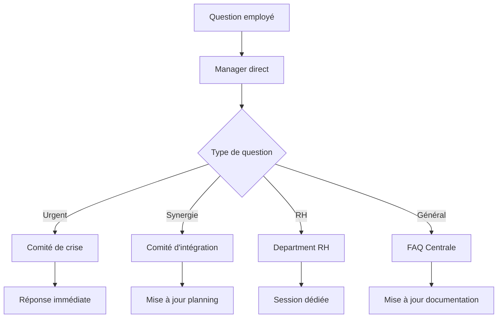

# Template de Communication Interne M&A

## Cadre de Communication pour les Opérations M&A

### Principe Fondamental
La communication interne pendant une opération M&A doit être **stratégique, cohérente et adaptée à chaque audience**. Une mauvaise communication peut générer des rumeurs, une perte de productivité ou un turnover clé.

### Phases de Communication

#### Phase 1: Pré-Transaction (Confidentialité Stricte)
**Audience**: Équipe du sponsor + Equipe de due diligence
**Canal**: Réunions en présentiel avec NDA strict
**Fréquence**: Hebdos

**Message Type**:
```
"Nous explorons des opportunités stratégiques pour accélérer notre croissance actuelle de [X]%. Cette phase de due diligence est cruciale pour évaluer l'alignement stratégique et les synergies potentielles."
```

**Points Clés**:
- Focus sur les objectifs stratégiques
- Importance de la confidentialité
- Processus d'évaluation en cours
- Aucune spéculation sur les cibles

#### Phase 2: Avant-Annonce (Préparation)
**Audience**: Comité de direction + Équipe projet
**Canal**: Réunions fermées + Briefings individuels
**Fréquence**: Jours 7-14 avant l'annonce

**Message Type**:
```
"Nous finalisons l'évaluation d'une opportunité stratégique majeure. Le [Date] sera l'annonce officielle à toutes les équipes."
```

**Actions Requises**:
- Préparation des managers locaux
- Messages clé par équipe
- FAQ préparées
- Calendrier de communication

#### Phase 3: Post-Annonce (Intégration)
**Audience**: Toutes les équipes
**Canal**: Town halls + Managers locaux + Email official
**Fréquence**: Quotidienne la première semaine, puis hebdomadaire

**Message Type**:
```
"Aujourd'hui, nous annonçons notre acquisition de [Cible], entreprise leader dans [Domaine]. Cette opération nous positionne pour [Stratégie] et créera de la valeur à travers [Synergies]."
```

### Matrice de Communication par Audience

#### Leadership Exécutif
**Objectif**: Vision stratégique et prise de décision
**Cadence**: Journalière (décision) → Hebdomadaire (intégration)
**Canal**: Briefings exécutifs + Dashboards
**Points Clés**:
- Synergies financières
- Impact stratégique
- Risques opérationnels
- Planning d'intégration

**Exemple de Dashboard**:
```markdown
| Indicateur | Valeur | Cible | Statut |
|------------|--------|-------|---------|
| Synergies Year 1 | €X | €Y | 🟢 |
| Intégration Planning | 90% | 100% | 🟡 |
| Risques identifiés | 5 | < 10 | 🟢 |
```

#### Management Intermediaire
**Objectif**: Gestion des équipes et exécution
**Cadence**: Hebdos + Points urgents
**Canal**: Réunions management + Comités thématiques
**Points Clés**:
- Impact sur les équipes
- Processus à suivre
- Points de contact
- Calendrier précis

#### Équipes Opérationnelles
**Objectif**: Continuité opérationnelle + Moral
**Cadence**: Quotidienne (1ère semaine) → Hebdomadaire
**Canal**: Town halls + Managers + FAQs
**Points Clés**:
- Pas de changement immédiat
- Calendrier des annonces
- Points de contact RH
- Processus de questions

#### Personnel Technique
**Objectif**: Continuité des systèmes + Integration technique
**Cadence**: Bimensuelle + Points urgents
**Canal**: Briefings techniques + Documentation
**Points Clés**:
- Roadmap technique
- Stack system concernée
- Planning d'intégration
- Impact sur le quotidien

### Calendar de Communication Standard

#### Semaine 1 (Annonce)
- **Jour 0**: Town hall général + Email de lancement
- **Jour 1**: Briefings par équipe avec manager
- **Jour 2**: Session Q&A pour toutes les équipes
- **Jour 3**: Focus équipes impactées (RH, Finance, IT)
- **Jour 5**: First week review + Plan semaine 2

#### Semaines 2-4 (Découverte)
- **Mardi**: Briefing management + Focus technique
- **Jeudi**: Questions récurrentes + Mise à jour planning
- **Vendredi**: State of the union + Focus équipes

#### Semaines 5-8 (Planification)
- **Bi-hebdo**: Comité d'intégration
- **Mensuel**: Town hall stratégique
- **As needed**: Comités thématiques spécifiques

### Messages Clés par Scénario

#### Scénario: Synergies Déclarées
```
"Cette acquisition nous permet de consolider notre position en [Marché] avec des synergies estimées à [Montant] d'ici [Date]. Nos équipes vont jouer un rôle clé dans la réussite de cette intégration."
```

#### Scénario: Marché International
```
"L'expansion vers [Pays] représente un marché de [Taille] avec une croissance de [%]. L'intégration permettra d'accélérer notre présence internationale tout en préservant notre culture d'innovation."
```

#### Scénario: Innovation
```
"La technologie [Technologie] de notre partenaire nous positionne en avant-garde du secteur. Cette acquisition transforme notre capacité d'innovation et ouvre de nouvelles opportunités commerciales."
```

### Toolkit de Communication

#### Templates Email

**Email d'Annonce**:
```
Objet: Annonce importante - Acquisition de [Cible]

Chers collègues,

Aujourd'hui, nous annonçons une étape majeure dans notre parcours de croissance : l'acquisition de [Cible], leader dans [Domaine].

Cette opération est stratégique car elle nous permettra de [Objectif stratégique] avec des synergies estimées à [Montant] d'ici [Date].

- Pour les équipes directement concernées, vous recevrez un briefing personnalisé
- Tous les autres participeront à un town hall la semaine prochaine
- RH organisera des sessions dédiées aux questions sur l'impact personnel

Votre management restera votre point de contact principal pour toute question.

Cordialement,
[Nom du CEO]
```

**Email de Suivi**:
```
Objet: Mise à jour sur l'acquisition de [Cible] - [Date]

Bonjour à tous,

Voici les actualités clés de la semaine concernant notre intégration :

📊 Progression: [X]% du planning initial
👥 Points de contact: Liste des comités et responsables
🎯 Prochaines étapes: [Suivi du planning]
❓ Questions: Canal dédié et bureau d'accueil

Nous restons à votre disposition pour toute question.

Merci de votre collaboration et de votre engagement dans cette transformation.
```

#### Templates Réunion

**Town Hall Template**:
```
[Sujet] - [Date] - [Heure]

Participants: Toutes les équipes
Durée: 90 minutes
Animateur: [Nom du CEO]

Ordre du jour:
1. Annonce et vision (15 min)
2. Planning détaillé (20 min)
3. Impact par équipe (30 min)
4. Q&A (25 min)

Préparation:
- Tester le son/caméra
- Préparer FAQ
- Désigner personnes clés
- Plan B technique

Distribution: Enregistrement + Slides
```

**Briefing Management**:
```
[Sujet] - [Date] - [Heure]

Participants: Comex + Managers
Durée: 120 minutes
Objectif: Alignement et plan d'action

Points clés:
- Risques identifiés
- Plan de contingence
- Messages clés
- Planning détaillé
- Plan de communication

Préparation: Préparer les cas d'usage spécifiques
```

### Gestion des Remontées

#### Canal de Communication
- **Urgent**: Manager direct + Comité d'urgence
- **Important**: Manager + RH + Communication
- **Normal**: Manager + FAQ centralisée

#### Processus de Remontée


### Mesures d'Efficacité

#### Indicateurs de Suivi
- **Taux d'engagement**: % d'employés présents aux réunions
- **Temps de réponse**: Moyenne de réponse aux questions
- **Satisfaction**: Enquêtes de satisfaction post-communication
- **Rumeurs**: Nombre de rumeurs détectées et traitées

#### Checkpoints de Qualité
- **Pré-com**: Validation par le comex + RH
- **Post-com**: Feedback des équipes et ajustements
- **Impact**: Suivi de l'ambiance et de la productivité
- **Alignement**: Vérification des messages auprès du management

### Scénarios de Gestion des Crises

#### Scénario: Fuite d'Information
**Actions**:
- Communication immédiate avec le message vérifié
- Briefing des managers
- Mise à jour des FAQs
- Calendrier de communication accéléré

**Message**:
```
"Nous avons connaissance des rumeurs concernant [Sujet]. Pour des raisons de transparence, nous pouvons confirmer que [Information exacte] et que le reste sont des spéulations. Nous vous communiquerons les informations officielles dès que possible."
```

#### Scénario: Opposition des Équipes
**Actions**:
- Sessions d'écoute dédiées
- Identification des leaders d'opinion
- Focus sur les bénéfices individuels
- Communication cas par cas

**Message**:
```
"Nous comprenons vos préoccupations concernant [Point]. Ces points seront abordés dans le cadre du comité [Comité] avec la participation des représentants des équipes. Vos feedbacks sont essentiels pour la réussite de cette intégration."
```

#### Scénario: Retard du Planning
**Actions**:
- Communication proactive du nouveau planning
- Explication des raisons et bénéfices
- Focus sur les étapes clés
- Mise à jour des canaux de communication

**Message**:
```
"Pour assurer une intégration réussie, nous ajustons notre planning avec une phase d'intégration plus approfondie. Cette décision permettra de maximiser les synergies et de garantir la stabilité opérationnelle. Les prochaines étapes seront communiquées individuellement."
```

### Template de Reporting

#### Rapport Hebdomadaire de Communication
```
Rapport de Communication M&A - [Date]

=== SYNTHESE ===
- Sessions réalisées: [Nombre]
- Participants: [Nombre]
- Taux d'engagement: [%]
- Principaux enseignements: [Résumé]

=== METRIQUES ===
- Satisfaction: [Score]/5
- Questions restantes: [Nombre]
- Actions en attente: [Liste]
- Risques identifiés: [Liste]

=== PROCHAINES ETAPES ===
- [Étape 1]: [Date] - [Responsable]
- [Étape 2]: [Date] - [Responsable]
- [Étape 3]: [Date] - [Responsable]

=== BUDGET ===
- Coût total: [Montant]
- Canaux: [Répartition]
- ROI: [Indicateur]
```

## Related
[[_system/MOC-patterns]]
[[brantham/_MOC]]

---
*Ce template fournit un cadre complet pour gérer la communication interne pendant les opérations M&A, avec des messages adaptés à chaque audience, un planning détaillé et des outils pratiques pour assurer une intégration fluide.*