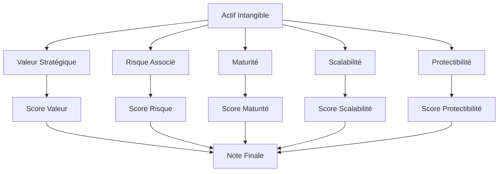
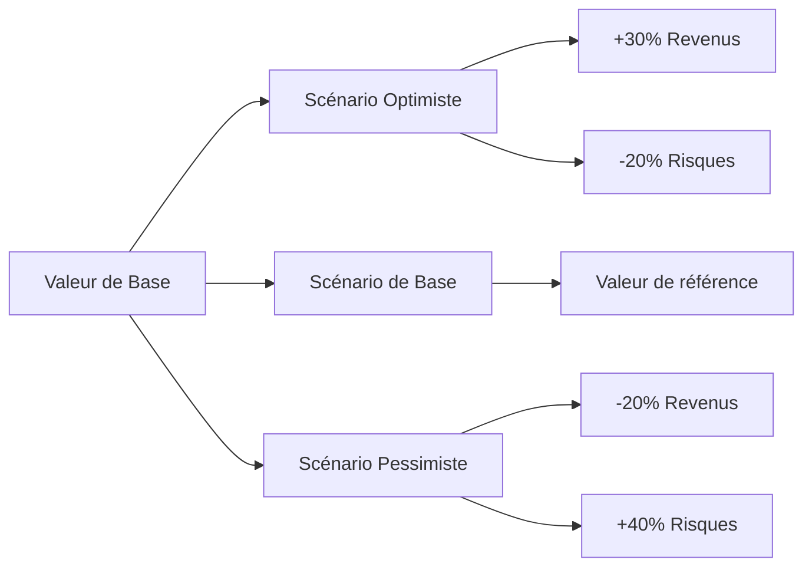

# Modèle de Valorisation d'Actifs Intangibles

## Cadre Complet de Valorisation des Actifs Immatériels

### Introduction
Les actifs intangibles représentent souvent 70-90% de la valeur d'une entreprise moderne. Ce modèle fournit une méthodologie structurée pour évaluer ces actifs dans le contexte des opérations M&A, en combinant approches market-based, income-based et cost-based.

### Classification des Actifs Intangibles

#### Actifs Stratégiques
**Brevets et Propriété Intellectuelle**
- Technologie propriétaire, brevents en cours, marques déposées
- Valeur: Protection du marché, barrières à l'entrée
- Risques: Obsolescence, contrefaçon, invalidité

**Logiciels et Plateformes**
- Code source, plateformes SaaS, algorithmes propriétaires
- Valeur: Scalabilité, effets de réseau, données
- Risques: Maintenance, évolution technologique

**Données et Analytics**
- Bases de données clients, données propriétaires, modèles prédictifs
- Valeur: Intelligence commerciale, personnalisation, optimisation
- Risques: Vieillissement, protection, portabilité

#### Actifs Commerciaux
**Marques et Réputation**
- Reconnaissance de marque, goodwill, réputation client
- Valeur: Prime de prix, fidélité, confiance
- Risques: Reputational risk, changement de perception

**Relations Client**
- Base de clients fidèles, contrats récurrents, réseau de distribution
- Valeur: Recurring revenue, acquisition costs réduits
- Risques: Churn, dépendance, relation fragile

**Réseau de Partenaires**
- Écosystème de partenaires, alliances stratégiques, canaux de distribution
- Valeur: Accès au marché, expansion, innovation
- Risques: Dépendance, rupture, perte de contrôle

#### Actifs Organisationnels
**Compétences et Talents**
- Capital humain, expertise technique, savoir-faire
- Valeur: Innovation, exécution, culture d'entreprise
- Risques: Turnover, perte de compétences, dépendance

**Processus et Systèmes**
- Méthodes opératoires, systèmes internes, best practices
- Valeur: Efficacité, qualité, standardisation
- Risques: Obsolescence, complexité, résistance

**Culture et Valeurs**
- Valeurs organisationnelles, pratiques managériales, engagement
- Valeur: Cohésion, motivation, rétention
- Risques: Incompatibilité culturelle, perte d'identité

### Méthodologies de Valorisation

#### Approche Market-Based
**Comparables Publics**
```python
def market_valuation(asset_category, company_size, sector):
    # Multiples sectoriels par catégorie d'actif
    sector_multiples = {
        'technology': {'patents': 8-15, 'software': 6-12, 'data': 5-10},
        'healthcare': {'patents': 12-20, 'data': 8-15, 'brands': 4-8},
        'finance': {'brands': 6-10, 'data': 4-8, 'software': 5-9}
    }
    
    # Ajustement par taille
    size_multiplier = {
        'small': 0.8,
        'medium': 1.0,
        'large': 1.2
    }
    
    base_multiple = sector_multiples[sector][asset_category]
    size_adj = size_multiplier[company_size]
    
    return base_multiple * size_adj
```

**Transactions Récentes**
- Analyse des acquisitions similaires
- Multiples de transaction comparables
- Premiums ou discounts sectoriels
- Ajustements pour différences spécifiques

**Benchmarks Sectoriels**
- Valorisation relative au secteur
- Positionnement compétitif
- Prime d'innovation ou d'excellence
- Analyse des écarts de valorisation

#### Approche Income-Based
**Discounted Cash Flow (DCF)**
```python
def dcf_valuation(asset_revenue, growth_rate, discount_rate, terminal_multiple, years=5):
    """
    Valorisation DCF pour actifs intangibles
    """
    cash_flows = []
    
    for year in range(1, years + 1):
        cash_flow = asset_revenue * (1 + growth_rate) ** year
        cash_flows.append(cash_flow / (1 + discount_rate) ** year)
    
    terminal_value = (asset_revenue * (1 + growth_rate) ** years * terminal_multiple) / (1 + discount_rate) ** years
    
    return sum(cash_flows) + terminal_value
```

**Multi-Revenus**
- Multiple de revenu sectoriel
- Ajustement pour la qualité des revenus
- Facteur de croissance attendue
- Prime pour la récurrentité

**Multi-EBITDA**
- Multiple EBITDA ajusté pour actifs intangibles
- Contribution à la rentabilité
- Effet de levier opérationnel
- Valeur stratégique additionnelle

#### Approche Cost-Based
**Coût de Remplacement**
- Coût de développement à neuf
- Temps et ressources nécessaires
- Coût d'acquisition externe
- Prime pour la rapidité d'acquisition

**Coût de Développement**
- Coût historique de création
- Investissements accumulés
- Coût d'opportunité
- Amortissement et obsolescence

**Valeur Coût d'Opportunité**
- Coût si développé internement
- Temps de développement estimé
- Ressources nécessaires
- Prime pour la rapidité d'acquisition

### Modèle de Scoring des Actifs Intangibles

#### Évaluation Multicritère


**Grille d'Évaluation**
| Critère | Poids | Score (1-5) | Pondéré |
|---------|-------|-------------|---------|
| Valeur stratégique | 25% | | |
| Risque associé | 20% | | |
| Maturité | 15% | | |
| Scalabilité | 20% | | |
| Protectibilité | 20% | | |

**Calcul de la Note Finale**
```
Note Finale = Σ(Score Critère × Poids Critère)
→ Excellent: 4.5-5.0
→ Bon: 3.5-4.4
→ Moyen: 2.5-3.4
→ Faible: 1.5-2.4
→ Critique: <1.5
```

### Framework de Valorisation par Secteur

#### Technologie
**Actifs Clés**: Brevets, logiciels, données, talent
**Multiples**: 6-15x EBITDA
**Facteurs Clés**:
- Nombre et qualité des brevets
- Scalabilité de la plateforme
- Effets de réseau
- Cycle de vie technologique

**Exemple de Calcul**:
```python
tech_valuation = {
    'patents': {
        'count': 25,
        'quality_score': 4.2,
        'revenue_impact': 0.3
    },
    'software': {
        'platform_users': 50000,
        'recurring_revenue': 0.7,
        'scalability': 0.8
    },
    'data': {
        'uniqueness': 0.9,
        'monetization_potential': 0.6,
        'protection': 0.8
    }
}
```

#### Healthcare
**Actifs Clés**: Brevets, données cliniques, marques, relations
**Multiples**: 8-20x EBITDA
**Facteurs Clés**:
- Pipeline de produits
- Données cliniques
- Régulations
- Réputation clinique

#### Finance
**Actifs Clés**: Données, logiciels, marques, relations
**Multiples**: 4-10x EBITDA
**Facteurs Clés**:
- Qualité des données
- Régulations
- Fidélité client
- Technologie d'infrastructure

#### Consommation
**Actifs Clés**: Marques, relations client, distribution
**Multiples**: 3-8x EBITDA
**Facteurs Clés**:
- Reconnaissance de marque
- Fidélité client
- Canaux de distribution
- Positionnement prix

### Processus de Due Diligence des Actifs Intangibles

#### Étape 1: Inventaire Complet
- Identification de tous les actifs intangibles
- Documentation légale et contractuelle
- Historique de développement et acquisition
- Évaluation de la maturité et de l'utilité

#### Étape 2: Validation Juridique
- Vérification des droits de propriété
- Analyse des contrats liés
- Évaluation des litiges potentiels
- Compliance réglementaire

#### Étape 3: Économique et Stratégique
- Contribution aux revenus et profits
- Impact sur la compétitivité
- Potentiel de croissance
- Risques et vulnérabilités

#### Étape 4: Valorisation Quantitative
- Application des méthodologies appropriées
- Analyse des comparables
- Calcul des multiples et premiums
- Sensibilité aux hypothèses

### Outils d'Analyse et Modèles

#### Modèle de Calcul des Synergies
```python
def synergy_valuation(target_intangibles, acquirer_capabilities):
    """
    Calcul de la valeur des synergies liées aux actifs intangibles
    """
    synergies = {}
    
    # Synergies de revenu
    revenue_synergy = target_intangibles['revenue'] * acquirer_capabilities['cross_sell']
    synergies['revenue'] = revenue_synergy
    
    # Synergies de coût
    cost_synergy = target_intangibles['costs'] * acquirer_capabilities['efficiency']
    synergies['cost'] = cost_synergy
    
    # Synergies technologiques
    tech_synergy = target_intangibles['technology'] * acquirer_capabilities['integration']
    synergies['technology'] = tech_synergy
    
    # Valeur temporelle
    time_value = sum(synergies.values()) * 0.1  # 10% de valeur temporelle
    
    return {
        'direct_synergies': sum(synergies.values()),
        'time_value': time_value,
        'total_value': sum(synergies.values()) + time_value
    }
```

#### Analyse de Sensibilité


#### Modèle d'Évaluation du Risque
```python
def risk_assessment(asset):
    """
    Évaluation du risque associé à un actif intangible
    """
    risk_factors = {
        'obsolescence_risk': asset['tech_cycle'] * 0.3,
        'legal_risk': asset['legal_strength'] * 0.2,
        'market_risk': asset['market_vulnerability'] * 0.25,
        'execution_risk': asset['integration_complexity'] * 0.25
    }
    
    total_risk = sum(risk_factors.values())
    
    risk_level = {
        'low': total_risk < 0.3,
        'medium': 0.3 <= total_risk < 0.6,
        'high': total_risk >= 0.6
    }
    
    return {
        'risk_score': total_risk,
        'risk_level': next(k for k, v in risk_level.items() if v),
        'risk_factors': risk_factors
    }
```

### Métriques de Performance des Actifs Intangibles

#### Indicateurs de Performance Clés
**Indicateurs Financiers**
- ROI des actifs intangibles
- Contribution aux revenus
- Marges générées
- Valeur temps actualisée

**Indicateurs Opérationnels**
- Taux d'adoption
- Efficacité d'utilisation
- Temps de mise à jour
- Coût de maintenance

**Indicateurs Stratégiques**
- Positionnement concurrentiel
- Avantage durable
- Innovation continue
- Alignement stratégique

### Cas Pratiques d'Application

#### Cas 1: Acquisition Technologique
**Contexte**: Acquisition d'une startup avec 15 brevets
**Actifs**: Brevets, algorithmes, données clients
**Méthodologie**: Market-based + DCF
**Résultat**: Valorisation à 8x EBITDA avec premium de 25%

#### Cas 2: Fusion Marque
**Contexte**: Fusion de deux marques de consommation
**Actifs**: Marques, relation client, distribution
**Méthodologie**: Multi-revenus + goodwill
**Résultat**: Valorisation à 6x EBITDA avec ajustement culturel

#### Cas 3: Acquisition de Données
**Contexte**: Acquisition d'une base de données propriétaires
**Actifs**: Données, modèles prédictifs, portail
**Méthodologie**: DCF + valeur d'usage
**Résultat**: Valorisation basée sur la valeur monétisation

### Best Practices et Éviter les Pièges

#### Pratiques Recommandées
- **Combiner méthodes**: Ne pas se fier à une seule approche
- **Valider les droits**: Vérifier la propriété et l'exploitation
- **Analyser les synergies**: Évaluer l'impact de l'acquisition
- **Mettre à jour régulièrement**: Les actifs intangibles évoluent
- **Documenter tout**: Historique, décisions, hypothèses

#### Pièges à Éviter
- **Survalorisation**: Objectif trop optimiste
- **Sous-évaluation**: Ignorer des actifs importants
- **Obsolescence**: Ne pas anticiper les changements technologiques
- **Dépendance**: Se reposer sur un seul type d'actif
- **Intégration**: Sous-estimer les coûts d'intégration

### Template de Reporting de Valorisation

#### Résumé Exécutif
```
Valorisation des Actifs Intangibles - [Cible]

=== SYNTHÈSE ===
- Valeur totale: [Montant] ([%] de la valorisation totale)
- Actifs clés: [Liste des 3 principaux actifs]
- Multiples utilisés: [Multiples sectoriels]
- Prime/discount: [Raison de l'ajustement]

=== PRINCIPAUX ACTIFS ===
1. [Actif 1]: [Valeur] - [Justification]
2. [Actif 2]: [Valeur] - [Justification]
3. [Actif 3]: [Valeur] - [Justification]

=== SYNERGIES POTENTIELLES ===
- [Type de synergie]: [Valeur]
- [Type de synergie]: [Valeur]
- Total: [Montant]

=== RISQUES IDENTIFIÉS ===
- [Risque 1]: [Impact] - [Mitigation]
- [Risque 2]: [Impact] - [Mitigation]
```

#### Détail Methodologique
```
=== MÉTHODOLOGIES UTILISÉES ===
1. Market-Based:
   - Comparables: [Liste]
   - Multiples: [Valeurs]
   - Ajustements: [Raisons]

2. Income-Based:
   - Revenus projetés: [Montants]
   - Taux d'actualisation: [%]
   - Croissance: [%]

3. Cost-Based:
   - Coût de remplacement: [Montant]
   - Investissements passés: [Montant]
   - Coût d'opportunité: [Montant]

=== HYPOTHÈSES CLÉS ===
- [Hypothèse 1]: [Valeur] - [Base]
- [Hypothèse 2]: [Valeur] - [Base]
- [Hypothèse 3]: [Valeur] - [Base]
```

## Related
[[_system/MOC-patterns]]
[[brantham/_MOC]]

---
*Ce modèle de valorisation d'actifs intangibles fournit une méthodologie complète pour évaluer la valeur des actifs immatériels dans les opérations M&A, combinant approches market-based, income-based et cost-based avec des outils pratiques pour l'analyse et la prise de décision.*