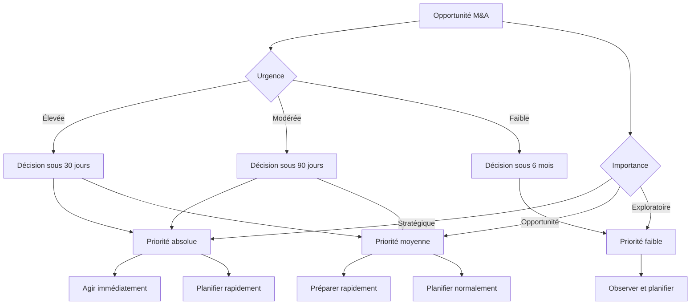

# Analyse de Timing Marché M&A

## Cadre d'Analyse du Timing Stratégique

### Introduction
Le timing est un facteur critique dans les opérations M&A. Une même transaction peut être transformationnelle ou coûteuse selon le moment où elle est réalisée. Cette analyse combine indicateurs macroéconomiques, sectoriels et spécifiques à la transaction pour optimiser la timing des acquisitions.

### Méthodologie d'Évaluation

#### Modèle de Maturité du Cycle M&A
**Phase 1: Début de Cycle (Buyer's Market)**
- Indicateurs: Faible activité M&A, multiples sous-valorisés
- Stratégie: Acquisition agressive de parts de marché
- Risques: Intégration prématurée, manque d'efficacité

**Phase 2: Milieu de Cycle (Consolidation)**
- Indicateurs: Activité M&A moyenne, multiples équilibrés
- Stratégie: Acquisition de cibles complémentaires
- Risques: Survalorisation, concurrence accrue

**Phase 3: Fin de Cycle (Seller's Market)**
- Indicateurs: Activité M&A intense, multiples surévalués
- Stratégie: Focus sur synergies et efficacité
- Risques: Coûts élevés, intégration complexe

**Phase 4: Correction (Market Reset)**
- Indicateurs: Marché baissier, multiples déprimés
- Stratégie: Positionnement pour reprise
- Risques: Valeur future incertaine, liquidité réduite

### Matrice d'Indicateurs de Timing

#### Indicateurs Macroéconomiques
**Taux d'Intérêt**
- Impact sur le coût du financement
- Optimal: Taux modérés (3-5% pour la zone Euro)
- Risque: Taux > 7% réduit les opportunités d'acquisition

**Cours Boursier**
- Valeur des actions comme monnaie d'échange
- Optimal: Marché haussier avec multiples raisonnables
- Risque: Marché baissier réduit la capacité d'émission d'actions

**Croissance Économique**
- Impact sur les revenus futurs des cibles
- Optimal: Croissance > 2% avec perspectives stables
- Risque: Récession réduit la valeur des synergies

**Confiance des Investisseurs**
- Disponibilité du capital
- Optimal: Sentiment positif avec appétit pour le risque
- Risque: Période de dé-leveraging limite les financements

#### Indicateurs Sectoriels
**Maturité du Secteur**
- Phase: Croissance → Maturité → Déclin
- Optimal: Secteur en croissance avec bénéfices d'échelle
- Risque: Secteur en déclin avec surcapacité

**Dynamique Concurrentielle**
- Niveau de consolidation du marché
- Optimal: Fragmenté avec opportunités de consolidation
- Risque: Déjà consolidé avec peu d'opportunités

**Innovation Technologique**
- Cycle d'obsolescence technologique
- Optimal: Innovation accélérée avec adoption rapide
- Risque: Technologie en déclin avec investissement perdant

**Reglementation**
- Évolution du cadre réglementaire
- Optimal: Stabilité réglementaire prévisible
- Risque: Changements majeurs créant de l'incertitude

#### Indicateurs Spécifiques à la Transaction
**Positionnement du Cible**
- Cycle de vie du business modèle
- Optimal: Positionnement fort avec croissance durable
- Risque: Positionnement déclinant ou dépendant

**Synergies Temporelles**
- Alignement avec les besoins stratégiques
- Optimal: Synergies immédiates et mesurables
- Risque: Synergies à long terme avec incertitude

**Intégration Timing**
- Complexité opérationnelle et temporelle
- Optimal: Complexité moyenne avec intégration réaliste
- Risque: Intégration complexe avec délais prolongés

**Capital Markets**
- Conditions de financement et de cotation
- Optimal: Marché favorable avec multiples attractifs
- Risque: Conditions difficiles avec coût du capital élevé

### Analyse du Cycle de Marché Actuel

#### Cycle Actuel: [Insérer Analyse]
- **Position**: Phase [Phase] du cycle M&A
- **Indicateurs clés**: [Liste des indicateurs pertinents]
- **Tendance**: [Direction actuelle]
- **Perspectives**: [Prochaines étapes probables]

#### Scénarios Probables pour les Prochains 12 Mois
**Scénario de Base (Probabilité: 60%)**
- Activité M&A modérée avec focus qualité
- Multiples sectoriels équilibrés
- Focus sur synergies opérationnelles
- Financement abordable mais sélectif

**Scénario Optimiste (Probabilité: 20%)**
- Reprise de l'activité M&A
- Multiples en légère hausse
- Accès facilité au capital
- Opportunités stratégiques nombreuses

**Scénario Pessimiste (Probabilité: 20%)**
- Ralentissement significatif de l'activité
- Multiples compressés
- Conditions de financement restrictives
- Focus sur la préservation de la valeur

### Framework de Timing des Transactions

#### Modèle de Score de Timing
```python
# Pondération des indicateurs
macro_weight = 0.3      # Pondération des indicateurs macroéconomiques
sector_weight = 0.4      # Pondération des indicateurs sectoriels
transaction_weight = 0.3 # Pondération des indicateurs spécifiques

def calculate_timing_score(macro_indicators, sector_indicators, transaction_indicators):
    # Calcul des sous-scores
    macro_score = sum(macro_indicators.values()) * macro_weight
    sector_score = sum(sector_indicators.values()) * sector_weight
    transaction_score = sum(transaction_indicators.values()) * transaction_weight
    
    # Score global (0-100)
    total_score = macro_score + sector_score + transaction_score
    
    # Interprétation
    if total_score >= 80:
        return "Excellent timing", "Green"
    elif total_score >= 60:
        return "Bon timing", "Yellow"
    elif total_score >= 40:
        return "Timing acceptable", "Orange"
    else:
        return "Timing à éviter", "Red"
```

#### Grille de Décision
| Score | Action | Risque |
|-------|--------|---------|
| 80-100 | Agir maintenant | Très faible |
| 60-79 | Préparer et agir | Faible |
| 40-59 | Observer et planifier | Modéré |
| 20-39 | Réévaluer | Élevé |
| 0-19 | Reporter ou abandonner | Très élevé |

### Calendrier Optimal par Type de Transaction

#### Acquisition Stratégique
**Timing Optimal**: 
- H1 d'un cycle en croissance
- Période post-résultats trimestriels
- Avant les annonces majeures du secteur
- Lorsque le cible publie de bons résultats

**Périodes à Éviter**:
- Fin d'année (concentrations des décisions)
- Périodes électorales majeures
- Jours de forte volatilité boursière
- Saison des vacances d'été

#### Acquisition de Croissance
**Timing Optimal**:
- Début de cycle de marché
- Périodes d'innovation sectorielle
- Avant l'épuisement du marché actuel
- Lorsque les multiples sont favorables

**Stratégie de Timing**:
```
Phase 1: Identifier les opportunités (3-6 mois)
Phase 2: Due diligence accélérée (1-2 mois)
Phase 3: Acquisition rapide (1 mois)
Phase 4: Intégration immédiate (3-6 mois)
```

#### Acquisition de Synergie
**Timing Optimal**:
- Milieu de cycle avec activité consolidée
- Périodes d'efficacité opérationnelle
- Lorsque les coûts d'intégration sont maîtrisés
- Après une période de restructuration réussie

### Outils d'Analyse en Temps Réel

#### Tableau de Bord de Timing
```markdown
| Indicateur | Valeur Actuelle | Cible | Tendance | Impact |
|------------|-----------------|-------|----------|---------|
| Taux d'intérêt | 4.2% | 3-5% | Stable | Positif |
| Multiples sectoriels | 8.5x | 7-9x | Légère baisse | Neutre |
| Activité M&A | 120 transactions | 150-200 | Stable | Modéré |
| Croissance sectorielle | 5.2% | 4-6% | Haussière | Positif |
| Sentiment marché | 65/100 | 70-80 | Stable | Positif |
```

#### Indicateurs Avancés
**Market Sentiment Score**
- Basé sur les flux de capital
- Analyse des primes de risque
- Enquêtes auprès des investisseurs
- Indicateurs de comportement

**Opportunité Relative**
- Comparaison des multiples actuels vs historiques
- Écart de valorisation entre secteurs
- Analyse des flux M&A par taille
- Évaluation des arbitrages sectoriels

### Scénarios Sectoriels par Timing

#### Technologie - 2026
**Phase**: Croissance accélérée
**Timing Actuel**: Favorable (Score: 75/100)
**Indicateurs Clés**:
- Innovation rapide avec adoption de l'IA
- Financement abondant pour scale-ups
- Multiples élevés mais justifiés
- Focus sur l'acquisition de technologie

**Recommandation**: Agir maintenant sur les opportunités de leader émergent

#### Healthcare - 2026
**Phase**: Consolidation
**Timing Actuel**: Modéré (Score: 60/100)
**Indicateurs Clés**:
- Pression réglementaire croissante
- Consommation stabilisée
- Consolidation des services
- Focus sur l'efficacité

**Recommandation**: Préparer les acquisitions mais attendre des opportunités de prix

#### Manufacturing - 2026
**Phase**: Transformation digitale
**Timing Actuel**: Équilibré (Score: 65/100)
**Indicateurs Clés**:
- Automatisation et digitalisation
- Re-shoring tendencies
- Multiples attractifs
- Focus sur les synergies opérationnelles

**Recommandation**: Cibler les entreprises avec des technologies clés

#### Finances - 2026
**Phase**: Réglementation et intégration
**Timing Actuel**: Prudent (Score: 45/100)
**Indicateurs Clés**:
- Environnement réglementaire strict
- Marges compressées
- Concentration bancaire
- Focus sur l'efficacité

**Recommandation**: Attendre des clarifications réglementaires

### Stratégies de Timing par Objectif

#### Objectif: Expansion de Marché
**Timing Optimal**: Début de cycle sectoriel
**Indicateurs**: Croissance forte, faible fragmentation
**Risques**: Surévaluation, intégration rapide
**Approche**: Acquisition agressive des leaders émergents

**Checklist**:
- [ ] Croissance sectorielle > 10%
- [ ] Fragmentation du marché > 40%
- [ ] Multiples < sector average
- [ ] Intégration réalisable en 6 mois
- [ ] Ressources humaines disponibles

#### Objectif: Acquisition Technologique
**Timing Optimal**: Période d'innovation majeure
**Indicateurs**: Investissements R&D élevés, brevets actifs
**Risques**: Obsolescence rapide, compétition intense
**Approche**: Due diligence accélérée, acquisition rapide

**Checklist**:
- [ ] Innovation récente avec adoption > 20%
- [ ] Pipeline de produits clair
- [ ] Brevets et IP vérifiés
- [ ] Équipe technique stable
- [ ] Roadmap alignée

#### Objectif: Synergies de Coût
**Timing Optimal**: Milieu de cycle avec pression sur marges
**Indicateurs**: Marges compressées, surcapacité
**Risques**: Résistance interne, integration complexe
**Approche**: Ciblage précis, communication intensive

**Checklist**:
- [ ] Synergies identifiablees > 15%
- [ ] Cible dans le même secteur
- [ ] Processus similaires
- [ ] Culture compatible
- [ ] Management d'intérgation expérimenté

### Framework d'Évaluation des Opportunités

#### Matrice d'Urgence-Importance


### Processus de Décision en Temps Réel

#### Étape 1: Monitoring Constant
- Suivi des indicateurs macroéconomiques
- Analyse des tendances sectorielles
- Surveillance des multiples de valorisation
- Évaluation des conditions de financement

#### Étape 2: Identification des Opportunités
- Analyse des cibles potentielles
- Évaluation du timing spécifique
- Calcul des synergies potentielles
- Évaluation des risques associés

#### Étape 3: Validation Stratégique
- Alignement avec la stratégie globale
- Analyse de l'impact sur le portefeuille
- Évaluation des ressources nécessaires
- Analyse des scénarios de sortie

#### Étape 4: Décision d'Achat
- Score final de timing
- Validation du budget
- Approbation du comité
- Plan d'exécution détaillé

### Risques et Mitigation

#### Risques de Timing
**Risque: Surévaluation**
- Symptôme: Multiples > secteur de 30%
- Mitigation: Attendre correction ou négocier agressivement

**Risque: Conditions de financement défavorables**
- Symptôme: Taux > 7%, spread élargi
- Mitigation: Réévaluer le financement ou reporter

**Risque: Intégration prématurée**
- Symptôme: Complexité sous-estimée
- Mitigation: Planification détaillée, gestion des attentes

**Risque: Changement de réglementation**
- Symptôme: Nouvelles régulations majeures
- Mitigation: Flexibilité contractuelle, clauses d'ajustement

### Best Practices

#### Préparation en Permanence
- Maintenir une pipeline de cibles potentiels
- Mettre à jour les analyses sectorielles
- Préparer les documents de due diligence
- Maintenir des relations avec les cibles

#### Flexibilité dans l'Exécution
- Préparer plusieurs scénarios de timing
- Maintenir des options d'achat et de vente
- Adapter les stratégies selon les conditions
- Équilibrer vitesse et rigueur

#### Communication Stratégique
- Transparence avec les parties prenantes
- Gestion des attentes du marché
- Communication interne ciblée
- Gestion de l'information sensible

## Related
[[_system/MOC-patterns]]
[[brantham/_MOC]]

---
*Cette analyse de timing fournit un cadre méthodique pour évaluer le moment optimal des opérations M&A en combinant indicateurs macroéconomiques, sectoriels et spécifiques à la transaction, permettant une prise de décision éclairée et une optimisation du timing stratégique.*