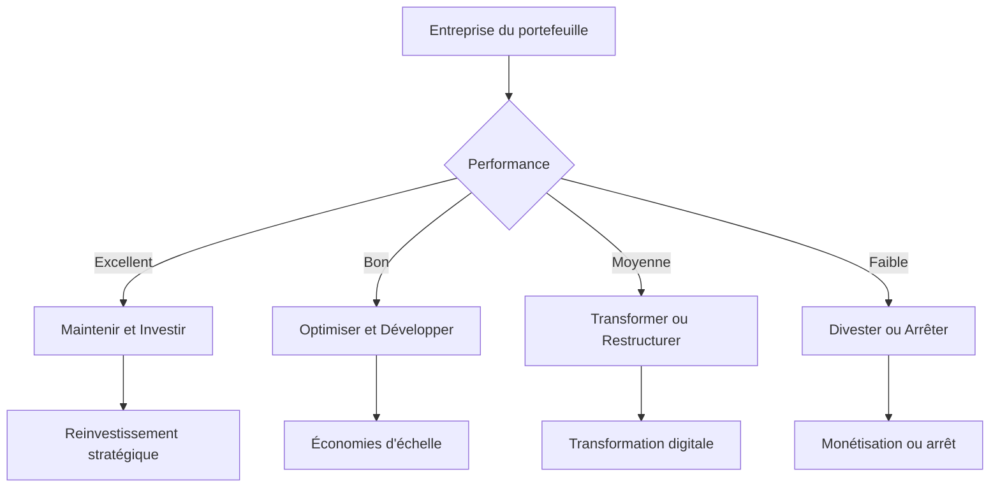

# Framework d'Analyse de Portefeuille Post-Acquisition

## Évaluation Stratégique du Portefeuille Intégré

### Introduction
L'analyse de portefeuille post-acquisition est cruciale pour optimiser la valeur créée et identifier les opportunités d'optimisation. Ce framework fournit une méthodologie systématique pour évaluer et améliorer le portefeuille d'entreprises après une intégration M&A.

### Étape 1: Cartographie du Portefeuille Intégré

#### Classification des Entreprises
```python
def classify_portfolio_company(company_data):
    """
    Classification des entreprises du portefeuille selon 4 dimensions
    """
    market_position = company_data['market_share']
    growth_rate = company_data['revenue_growth']
    profitability = company_data['margin']
    strategic_fit = company_data['synergy_score']
    
    # Classification matricielle
    if market_position > 20 and growth_rate > 10:
        return "Star - Leader avec croissance forte"
    elif market_position > 20 and growth_rate < 5:
        return "Cash Cow - Leader stable mais faible croissance"
    elif market_position < 10 and growth_rate > 10:
        return "Question Mark - Potentiel fort mais position faible"
    else:
        return "Dog - Position faible avec croissance limitée"
```

**Étoiles (Stars)**
- Caractéristiques: >20% de part de marché, croissance >10%
- Stratégie: Investir et développer
- Risques: Surchauffe, obsolescence
- Exemples: Plateforme leader avec forte innovation

**Vaches à Lait (Cash Cows)**
- Caractéristiques: >20% part de marché, croissance <5%
- Stratégie: Optimiser, générer cash
- Risques: Déclin lent, cannibalisation
- Exemples: Services matures avec forte base clients

**Points d'Interrogation (Question Marks)**
- Caractéristiques: <10% part de marché, croissance >10%
- Stratégie: Décider d'investir ou divester
- Risques: Brûlage de cash, échec
- Exemples: Startups innovantes avec position fragile

**Chiens (Dogs)**
- Caractéristiques: <10% part de marché, croissance <5%
- Stratégie: Divester ou restructurer
- Risques: Pertes continues, érosion
- Exemples: Activités en déclin technologique

### Étape 2: Analyse de Synergie Réelle vs Attendue

#### Matrice de Performance des Synergies
| Type de Synergie | Cible | Réalisé | Écart | Cause de l'Écart |
|------------------|-------|---------|-------|------------------|
| Revenus | 15M€ | 12M€ | -20% | Équipe de vente intégrée lentement |
| Coûts | 8M€ | 9M€ | +12% | Optimisation meilleure que prévu |
| Technologie | 5M€ | 3M€ | -40% | Complexité d'intégration sous-estimée |
| Achats | 3M€ | 2.5M€ | -17% | Pouvoirs négociateurs maintenus |

#### Analyse des Écarts
**Écarts Positifs (Sous-estimation)**
- Causes: Synergies culturelles, effets d'échelle anticipés
- Actions: Capitaliser sur les succès, partager les best practices
- Exemple: Optimisation des coûts supérieure aux prévisions

**Écarts Négatifs (Sur-estimation)**
- Causes: Résistance au changement, complexité technique, timings trop ambitieux
- Actions: Retraînement, révision des plannings, approches incrémentales
- Exemple: Difficultés d'intégration des systèmes informatiques

### Étape 3: Évaluation de la Création de Valeur

#### Modèle d'Évaluation de la Valeur Créée
```python
def value_creation_assessment(acquisition_data):
    """
    Calcul de la valeur créée réelle vs prévisionnelle
    """
    # Valeurs prévisionnelles
    forecast_synergies = acquisition_data['forecast_synergies']
    forecast_costs = acquisition_data['integration_costs']
    
    # Valeurs réelles
    actual_synergies = acquisition_data['actual_synergies']
    actual_costs = acquisition_data['actual_integration_costs']
    
    # Création de valeur nette
    net_value_created = (actual_synergies - actual_costs) - (forecast_synergies - forecast_costs)
    
    # Performance relative
    performance_ratio = actual_synergies / forecast_synergies if forecast_synergies > 0 else 0
    
    return {
        'net_value_created': net_value_created,
        'performance_ratio': performance_ratio,
        'value_creation_status': 
            'Excellent' if performance_ratio > 1.2 else
            'Bon' if performance_ratio > 1.0 else
            'Moyen' if performance_ratio > 0.8 else
            'Mauvais' if performance_ratio > 0.5 else 'Échec'
    }
```

#### Indicateurs de Performance Clés
**Indicateurs Financiers**
- Taux de réalisation des synergies (vs prévision)
- ROI du portefeuille intégré
- Marges améliorées
- Évolution des revenus consolidés

**Indicateurs Opérationnels**
- Taux d'intégration des systèmes
- Productivité par employé
- Temps de cycle des processus
- Qualité des services clients

**Indicateurs Humains**
- Taux de rétention des talents clés
- Satisfaction des employés
- Intégration culturelle réussie
- Efficacité des équipes mixtes

### Étape 4: Identification des Opportunités d'Optimisation

#### Matrice d'Optimisation du Portefeuille


**Stratégies d'Optimisation**

**Pour les Performants**
- Investir dans la croissance organique
- Développer de nouvelles synergies
- Étendre le marché géographique
- Innover avec les technologies de pointe

**Pour les Moyens**
- Optimiser les coûts opérationnels
- Améliorer l'efficacité des processus
- Renforcer la position concurrentielle
- Intégrer meilleures pratiques

**Pour les Faibles**
- Restructuration opérationnelle
- Cession des actifs non stratégiques
- Refocus sur le cœur de métier
- Préparation de la sortie ou du redéploiement

### Étape 5: Plan d'Action Stratégique

#### Plan d'Optimisation par Trimestre
**Trimestre 1 (Évaluation et Diagnostic)**
- [ ] Cartographie complète du portefeuille
- [ ] Analyse des synergies réalisées vs attendues
- [ ] Identification des opportunités
- [ ] Priorisation des actions

**Trimestre 2 (Planification et Préparation)**
- [ ] Développement des plans d'action détaillés
- [ ] Communication du plan aux équipes
- [ ] Allocation des ressources nécessaires
- [ ] Établissement des indicateurs de suivi

**Trimestre 3 (Exécution et Surveillance)**
- [ ] Mise en œuvre des actions prioritaires
- [ ] Surveillance des indicateurs clés
- [ ] Ajustements selon les résultats
- [ ] Communication régulière des progrès

**Trimestre 4 (Optimisation et Expansion)**
- [ ] Évaluation des résultats obtenus
- [ ] Consolidation des succès
- [ ] Planification de la phase suivante
- [ ] Capitalisation des leçons apprises

### Étape 6: Gestion du Changement et Communication

#### Stratégie de Communication du Portefeuille
**Messages Clés par Audience**
**Leadership**
- Focus sur la création de valeur et la stratégie globale
- Indicateurs financiers et de performance
- Risques et opportunités stratégiques

**Équipes**
- Impact personnel et opportunités de développement
- Calendrier et prochaines étapes
- Canaux de communication et feedback

**Marché**
- Vision stratégique renforcée
- Promesse client améliorée
- Positionnement concurrentiel

#### Indicateurs de Maturité du Changement
**Niveau 1: Connaissance**
- Taux de compréhension du plan (>80%)
- Participation aux réunions de communication
- Disponibilité des informations

**Niveau 2: Engagement**
- Adhésion aux nouvelles priorités
- Initiatives spontanées d'optimisation
- Collaboration inter-entreprises

**Niveau 3: Intégration**
- Processus standards communs
- Culture partagée et valeurs alignées
- Performance synergétique durable

### Étape 7: Surveillance Continue et Reporting

#### Tableau de Bord de Performance du Portefeuille
```markdown
# Tableau de Bord du Portefeuille - [Trimestre]

## Indicateurs de Performance Globale
| Indicateur | Cible | Réalisé | Écart | Tendance |
|-----------|-------|---------|-------|----------|
| Synergies Réalisées | 45M€ | 42M€ | -6.7% | ↗️ |
| ROI du Portefeuille | 18% | 15% | -16.7% | → |
| Taux de Rétention | 85% | 88% | +3.5% | ↗️ |
| Intégration Systèmes | 90% | 78% | -13.3% | ↘️ |

## Performance par Entreprise
| Entreprise | Type | Performance | Synergies | Actions |
|-----------|------|-------------|-----------|---------|
| [Entreprise A] | Star | Bon | 12M€ | Maintenir |
| [Entreprise B] | Cash Cow | Excellent | 8M€ | Optimiser |
| [Entreprise C] | Question Mark | Moyen | 5M€ | Décider |
| [Entreprise D] | Dog | Faible | -2M€ | Divester |

## Prochaines Étapes
- [ ] Finaliser l'intégration des systèmes d'entreprise D
- [ ] Lancer l'optimisation des coûts entreprise B
- [ ] Décider du sort de l'entreprise C
- [ ] Préparer l'investissement stratégique entreprise A
```

#### Review Trimestriel Stratégique
**Objectif**: Évaluer l'évolution et ajuster la stratégie
- Performance vs prévisions
- Nouvelles opportunités identifiées
- Risques émergents
- Prochaines priorités

### Cas Pratiques d'Application

#### Cas 1: Optimisation d'un Portefeuille Technologique
**Contexte**: Acquisition de 3 startups dans le SaaS
**Situation initiale**: Synergies sous-réalisées (-25%)
**Actions**: Restructuration des équipes, standardisation des processus
**Résultat**: Atteinte des synergies en 18 mois (+15% supplémentaires)

#### Cas 2: Transformation d'un Portefeuille Manufacturier
**Contexte**: Acquisition de 4 sites de production
**Situation initiale**: Forte fragmentation des systèmes
**Actions**: Digitalisation centralisée, optimisation logistique
**Résultat**: Réduction des coûts de 22%, intégration achevée en 24 mois

### Best Practices et Pièges à Éviter

#### Pratiques Recommandées
- **Évaluation continue**: Réviser le portefeuille tous les trimestres
- **Communication transparente**: Maintenir toutes les parties informées
- **Flexibilité**: Adapter la stratégie selon les résultats
- **Mesure objective**: Se baser sur des indicateurs clés de performance

#### Pièges à Éviter
- **Surallocation de ressources**: Concentrer sur les entreprises à fort potentiel
- **Intégration trop rapide**: Risque de perte d'entreprises clés
- **Négliger les synergies humaines**: Culture et leadership sont critiques
- **Manquer les signaux faibles**: Surveiller les indicateurs de risque

## Related
[[_system/MOC-patterns]]
[[brantham/_MOC]]

---
*Ce framework d'analyse de portefeuille post-acquisition fournit une méthodologie systématique pour évaluer, optimiser et surveiller la performance du portefeuille intégré, permettant de maximiser la valeur créée par les acquisitions et d'identifier rapidement les opportunités d'amélioration.*