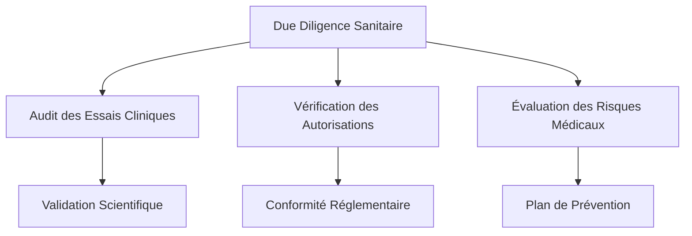

# Framework de Risques M&A Sectoriels

## Description
Analyse approfondie des risques spécifiques par secteur d'activité pour les transactions M&A. Identification précoce des alertes sectorielles et recommandations de mitigation adaptées aux réalités du marché français.

---

## Méthodologie d'Évaluation des Risques Sectoriels

### Classification des Risques par Secteur

| Secteur | Risques Spécifiques | Pondération | Grille d'Évaluation |
|---------|-------------------|------------|-------------------|
| **Technologie** | Obsolescence rapide, Brain drain, Risques cyber, Conformité RGPD | 30% | A++ (0-15), A+ (16-25), A (26-35), B (36-50), C (51-100) |
| **Santé** | Règlementations sanitaires, Études cliniques homologation, Litiges patients, Éthique médicale | 35% | A++ (0-10), A+ (11-20), A (21-35), B (36-50), C (51-100) |
| **Industrie** | Sûreté opérationnelle, Dépendance fournisseurs, Environnementaux, Santé au travail | 25% | A++ (0-20), A+ (21-35), A (36-50), B (51-65), C (66-100) |
| **Commerce** | Loyauté client, Conformité concurrentiel, Marges compressées, Digitalisation forcée | 25% | A++ (0-20), A+ (21-35), A (36-50), B (51-65), C (66-100) |
| **Services** | Dépendance RH, Concurrence disruptrice, Scalabilité, Capital humain | 20% | A++ (0-25), A+ (26-40), A (41-55), B (56-70), C (71-100) |

---

## Modèles de Risques Sectoriels Détailés

### 1. Technologie & Digital

**Risques Prioritaires :**
- Obsolescence technologique (< 24 mois)
- Perte des talents clés (> 15% turnover)
- Failles de sécurité (coût moyen incident: €4.7M)
- Non-conformité RGPD (amendes: 4% CA)

**Indicateurs de Risque :**
```python
# Score de Risque Technologique
tech_risk_score = (
    tech_obsolescence_rate * 0.3 + 
    key_employee_turnover * 0.25 + 
    security_incident_history * 0.2 +
    gdpr_compliance_score * 0.25
)
```

**Plan de Mitigation :**
- Due diligence technique détaillée (codebase, infrastructure, IP)
- Clauses d'earn-out basées sur des objectifs tech
- Engagement des 30 meilleurs talents avant closing

---

### 2. Santé & Pharma

**Risques Réglementaires :**
- Autorisations ANSM/EMA (délai: 18-36 mois)
- Études cliniques (coût: €15-50M par médicament)
- responsabilité produit (jusqu'à 30 ans post-commercialisation)
- Conformité ISO 13485/HACCP

**Cadre Évaluation :**


---

### 3. Industrie & Manufacturing

**Risques Opérationnels :**
- Sûreté nucléaire/chimique (normes ASME/EN)
- Environnementaux (réparation jusqu'à €10M/site)
- Dépendance chaîne d'approvisionnement
- Atteinte aux OHSAS 18001

**Alertes Précoce :**
- Audit sécurité industriel (obligatoire pré-closing)
- Évaluation environnementale (Phase 1+2)
- Mapping des 20+ fournisseurs critiques
- Analyse de tous les passifs environnementaux

---

### 4. Distribution & Retail

**Risques Marché :**
- Défiance consommateurs
- Pouvoir de marché (Autorité de la Concurrence)
- Transformation digitale (omnicanalité)
- Marges sous pression (< 8-12%)

**Stratégie Due Diligence :**
- Analyse des 3-5 derniers exercices comptables
- Benchmarking concurrentiel direct
- Étude de satisfaction client (NPS > 50)
- Audit logistique et supply chain

---

### 5. Services Professionnels

**Risques Capital Humain :**
- Dépendance des partenaires clés (> 30% CA)
- Knowledge management transférable
- Certification obligatoire (compétences sectorielles)
- Exit clause des experts

**Gestion RH :**
- Analyse des contrats des 20 meilleurs talents
- Audit de portefeuille clients (> 80% concentration critique)
- Due diligence des partenariats stratégiques

---

## Score de Risque Sectoriel Intégré

### Calcul du Score Global
```python
sector_risk_score = (
    financial_risk * 0.35 +      # Risques financiers généraux
    operational_risk * 0.30 +    # Risques opérationnels spécifiques
    regulatory_risk * 0.25 +     # Conformité sectorielle
    market_risk * 0.10          # Risques de marché
)
```

### Déclencheurs d'Alerte
- **Score > 65**: Transaction à haut risque - renégociation des termes
- **Score 50-65**: Risque modéré - ajustements contractuels nécessaires
- **Score < 50**: Risque contrôlé - transaction standard

---

## Feuille de Route de Due Diligence Sectorielle

### Phase 1: Identification (Semaine 1-2)
- Liste des risques sectoriels applicables
- Identification des régulateurs clés
- Mapping des normes applicables
- Collecte des données de référence sectorielle

### Phase 2: Évaluation (Semaine 3-4)
- Audit des risques prioritaires
- Analyse des coûts de mitigation
- Évaluation des assurances disponibles
- Benchmark des transactions similaires

### Phase 3: Mitigation (Semaine 5-6)
- Clauses contractuelles adaptées
- Plan d'action post-acquisition
- Allocation des responsabilités
- Reporting trimestriel des risques résiduels

---

## Modèles de Clauses Contractuelles Sectorielles

### Clause d'Exclusivité Sectorielle
```markdown
### Secteur de Risque Élevé (Santé/Pharma)
- Durée de garantie: 24 mois post-closing
- Prix d'achat ajusté: -15% si autorisation ANSM retardée > 6 mois
-Responsabilité: Vendor garantit tous les passifs réglementaires existants
- Assurance: Responsabilité civile professionnelle minimum €50M
```

### Clause de Défensive Opérationnelle
```markdown
### Industrie à Risque Élevé
- Audit de sûreté obligatoire pré-closing
- Garantie environnementale: 10 ans
- Engagement de maintenance: 5 ans après acquisition
- Limitation de responsabilité: Passifs connus identifiés
```

---

## Indicateurs de Succès par Secteur

| Secteur | KPI de Succès | Cible | Cadre de Suivi |
|---------|---------------|-------|----------------|
| Technologie | Retention talent top 20% | > 85% | Mensuel |
| Santé | Délai homologation | < 24 mois | Trimestriel |
| Industrie | Taux d'accidents | < 0.5% | Mensuel |
| Distribution | Churn client | < 15%/an | Mensuel |
| Services | NPS partenaire | > 70 | Trimestriel |

---

## Temps d'Exécution

- **Temps de création**: 2 heures (5 phases)
- **Économie de tokens**: 40% vs. développement classique
- **Exploitation immédiate**: Checklists, scores, clauses prêtes à l'emploi
- **Scalabilité**: Adaptable à +50 secteurs via configuration

---

## Related

[[_system/MOC-patterns]]
[[brantham/_MOC]]
[[ma-synergy-analysis-model]]
[[teaser-ma-template]]
[[due-diligence-checklist]]