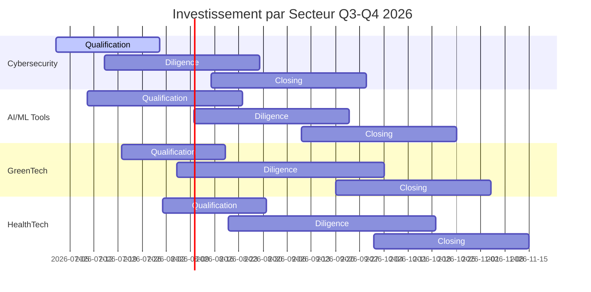

# Stratégie d'Investissement - Focus Secteurs 2026

## 🎯 Thématique Principale
**"Digitalisation & Transition Écologique"** - Secteurs résilients avec forte croissance et multiples attractifs.

---

## 🏆 Secteurs Prioritaires

### 1. Cybersecurity (35% allocation)
**Pourquoi maintenant**:
- Marché global: $400B+ (2026)
- Taux croissance: 15% CAGR
- France: 3ème marché européen
- Drivers: Règlementations, menaces croissantes

**Cibles idéales**:
- **SMB security**: 20-50 salariés, CA 5-20M€
- **Specialized tools**: SOC, MDR, threat intelligence
- **Regional players**: Fort position géographique

**Multiples cibles**: 12x-18x EBITDA
**Deal size**: 2-15M€
**Diligence focus**: Contract renewals, tech debt

### 2. AI/ML Tools (30% allocation)
**Pourquoi maintenant**:
- Inflection point: Enterprise adoption massive
- France: 2ème AI hub en Europe
- Funding: €15B+ invested in EU since 2023
- Use cases: Vertical-specific solutions

**Cibles idéales**:
- **Vertical AI**: Industry-specific ML platforms
- **Dev tools**: MLOps, data labeling, testing
- **Enabling tech**: APIs, infrastructure

**Multiples cibles**: 15x-25x EBITDA
**Deal size**: 1-10M€
**Diligence focus**: IP quality, team tech, data

### 3. GreenTech (20% allocation)
**Pourquoi maintenant**:
- EU Green Deal: €1T+ investment
- France: Plan de relance €30B GreenTech
- Regulations: CSRD, taxonomie verte
- Demand: Corporate ESG mandates

**Cibles idéales**:
- **Carbon accounting**: SaaS + services
- **Energy efficiency**: Building tech, industry
- **Circular economy**: Waste management, recycling

**Multiples cibles**: 8x-12x EBITDA
**Deal size**: 3-20M€
**Diligence focus**: Regulatory compliance, tech moat

### 4. HealthTech B2B (15% allocation)
**Pourquoi maintenant**:
- Aging population: France +30% 65+ by 2040
- Digital health acceleration post-COVID
- Reimbursement reforms: DPSP evolution
- Venture funding: $25B+ global in 2025

**Cibles idéales**:
- **Digital health**: Telemedicine, chronic care
- **Biotech services**: Lab automation, diagnostics
- **Healthcare admin**: Billing, compliance

**Multiples cibles**: 10x-15x EBITDA
**Deal size**: 5-25M€
**Diligence focus**: Regulatory path, clinical validation

---

## 📊 Allocation de Capital

### Budget Q3-Q4 2026
| Secteur | Allocation | Montant | Cibles | Deal Size |
|---------|-----------|---------|--------|-----------|
| Cybersecurity | 35% | 525,000€ | 3-4 deals | 2-15M€ |
| AI/ML Tools | 30% | 450,000€ | 4-5 deals | 1-10M€ |
| GreenTech | 20% | 300,000€ | 2-3 deals | 3-20M€ |
| HealthTech | 15% | 225,000€ | 2-3 deals | 5-25M€ |
| **Total** | **100%** | **1,500,000€** | **11-15 deals** | |

### Timing d'Investissement


---

## 🎯 Critères d'Investissement par Secteur

### Cybersecurity - Must Have
- [ ] Recurring revenue >70%
- [ ] Net retention >110%
- [ ] SOC 2/ISO 27001 certified
- [ ] Contract duration >12 months
- [ ] Team: CISO + security engineers

### AI/ML Tools - Must Have
- [ ] Proprietary IP (patents/algorithms)
- [ ] Technical moat (data, network effects)
- [ ] Enterprise adoption (Fortune 500 reference)
- [ ] Gross margins >70%
- [ ] Team: PhD + experienced engineers

### GreenTech - Must Have
- [ ] Regulatory compliance certified
- [ ] Clear ROI (<24 months payback)
- [ ] Government subsidies secured
- [ ] Long-term contracts (PPA, etc.)
- [ ] Technical validation (third-party)

### HealthTech - Must Have
- [ ] Regulatory pathway cleared (CE/FDA)
- [ ] Clinical validation (if applicable)
- [ ] Reimbursement strategy defined
- [ ] Partner network established
- [ ] Team: medical + commercial expertise

---

## 📈 Pipeline Stratégique

### Sourcing par Secteur
```python
SECTOR_CRITERIA = {
    'cybersecurity': {
        'keywords': ['cyber', 'security', 'SOC', 'MDR', 'threat'],
        'sectors': ['informatique', 'électronique'],
        'size_range': (20, 100),
        'revenue_min': 5000000
    },
    'ai_ml': {
        'keywords': ['AI', 'machine learning', 'data', 'ML', 'intelligence'],
        'sectors': ['tech', 'software'],
        'size_range': (15, 50),
        'revenue_min': 3000000
    },
    'greentech': {
        'keywords': ['green', 'carbon', 'energy', 'sustainable', 'ESG'],
        'sectors': ['environnement', 'énergie'],
        'size_range': (25, 150),
        'revenue_min': 8000000
    },
    'healthtech': {
        'keywords': ['health', 'medical', 'biotech', 'diagnostic', 'telemedicine'],
        'sectors': ['santé', 'médical'],
        'size_range': (30, 200),
        'revenue_min': 10000000
    }
}
```

### Performance Attendue
| Secteur | IRR Cible | Multiple Sortie | Risque | Horizon |
|---------|-----------|-----------------|--------|---------|
| Cybersecurity | 35% | 8x-12x | Moyen | 3-5 ans |
| AI/ML Tools | 40% | 10x-20x | Élevé | 3-7 ans |
| GreenTech | 25% | 6x-10x | Moyen | 5-7 ans |
| HealthTech | 30% | 8x-15x | Moyen | 4-6 ans |

---

## 🚨 Risques Sectoriels

### Cybersecurity Risques
- **Technological obsolescence**: Rapid changes
- **Talent war**: High attrition risk
- **Regulatory changes**: Compliances shifting

### AI/ML Tools Risques
- **Hype cycle**: Bubble potential
- **Competition**: Big players entry
- **Valuation**: Overheated market

### GreenTech Risques
- **Policy dependency**: Subsidies changes
- **Slow adoption**: Long sales cycles
- **Commoditization**: Low differentiation

### HealthTech Risques
- **Regulatory delays**: Approval uncertainty
- **Reimbursement**: Payer negotiations
- **Clinical validation**: Long timelines

---

## 💡 Investment Thesis

### Value Creation Levers
1. **Operational scaling**: Shared services, platforms
2. **Product expansion**: Cross-selling, adjacent markets
3. **Geographic expansion**: Regional consolidations
4. **Tech integration**: Platform synergies

### Exit Strategy Timeline
- **3-5 ans**: Strategic sale to PE/strategic buyer
- **5-7 ans**: Secondary sale to growth equity
- **7+ ans**: IPO for platform companies

### Competitive Advantage
- **Sector specialization**: Deep expertise vs generalist
- **Speed to market**: Process optimisé
- **Network effect**: Portfolio synergies
- **Regulatory navigation**: Local expertise

---

## 📊 Monitoring & Adjustments

### KPIs Trackers
- **Sector performance**: Returns vs expectations
- **Market timing**: Inflection points
- **Competitive landscape**: New entrants
- **Regulatory changes**: Impact assessment

### Quarterly Review
- **Allocation adjustments**: Based on performance
- **Criteria evolution**: Market feedback
- **New opportunities**: Emerging trends
- **Risk management**: Portfolio rebalancing

---

## 🎯 Success Metrics 2026

### Quantitatifs
- **11-15 deals** investis
- **€1.5M** deployed
- **35%+ IRR** target
- **8x+ multiple** target

### Qualitatifs
- **Sector leadership**: Position dans chaque vertical
- **Network effect**: Portfolio companies collaboration
- **Talent acquisition**: Key hires across portfolio
- **Reputation**: Brand as sector specialist

## Related
- [[brantham/deals/pipeline/pipeline-50-qualified-deals-q3-2026]]
- [[brantham/deals/benchmarks/metrics-benchmark-2025-2026]]
- [[brantham/strategy/_MOC]]
- [[brantham/_MOC]]