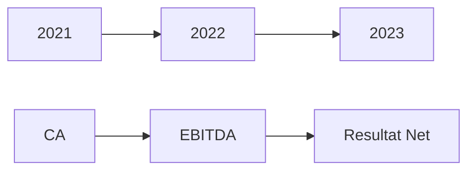

# Pitch Deck M&A Standardisé — Template

## Slide 1: Titre & Identité
**[Nom entreprise cible]**  
Opportunité d'acquisition stratégique  
*Date: 12 Juin 2026*

---

## Slide 2: Executive Summary
**L'opportunité en 3 points**
- Contexte distressed/restructuring
- Valeur fondamentale identifiée  
- Stratégie de sortie claire

**Montant cible**: € **Durée**: 6-12 mois

---

## Slide 3: Profil Cible
| **Key Metrics** | **Valeur** | **Trend** |
|-----------------|------------|-----------|
| CA 2023 | € | ▲ ▼ ➖ |
| EBITDA 2023 | € | ▲ ▼ ➖ |
| Effectif | | |
| Cession: % Capital | | |

**Business Model**: [Brève description]

---

## Slide 4: Marché & Positionnement
**Marché**: € M taille  
**Positionnement**: [Premium/Mid-market/Budget]  
**Part de marché**: % estimée

**Barrières à l'entrée**:  
- [ ] Réglementaires
- [ ] Économiques  
- [ ] Technologiques

---

## Slide 5: Performance Financière (3 ans)

**Key Insights**:  
- Croissance CA CAGR: %  
- Marge EBITDA: %  
- Rentabilité nette: %

---

## Slide 6: Synergies Acquiseur
**Synergies estimées**: € / an

**Opérations**:  
- Rationalisation: €  
- Achats groupés: €  
- Optimisation digitale: €

**Timeline**:  
- Mois 1-3: Synergies quick wins  
- Mois 4-12: Synergies structurelles

---

## Slide 7: Risques & Mitigation
**Risques Principaux**:  
- [ ] Financier: €  
- [ ] Juridique: Projet  
- [ ] Opérationnel:  
- [ ] Marché:  

**Plan de Mitigation**:  
- [ ] Action corrective  
- [ ] Timing  
- [ ] Budget  

---

## Slide 8: Valorisation
**Méthodes utilisées**:  
- DCF: €  
- Comps: €  
- Transactions: €  

**Fourchette valorisation**: € - €  
**Multiple EV/EBITDA**: x  

---

## Slide 9: Structure Transactionnelle
**Terms Sheet**:  
- Prix: €  
- Paiement: % cash / % earn-out  
- Closing:  
- Due diligence:  

**Regulatory**: [Autorisations nécessaires]

---

## Slide 10: Prochaines Étapes
**Timeline**:  
- Semaine 1-2: ND  
- Semaine 3-4: DD  
- Semaine 5-6: LOI  
- Mois 3-6: Closing  

**Team**: [Responsables, Banquiers, Avocats]

---

## Slide 11: Contacts
**Brantham Partners**  
*Nom, Contact*  
*Date*

---

## Related
[[brantham/_MOC]]
[[_system/MOC-patterns]]
[[_system/MOC-decisions]]

*Template standardisé M&A - 2026*